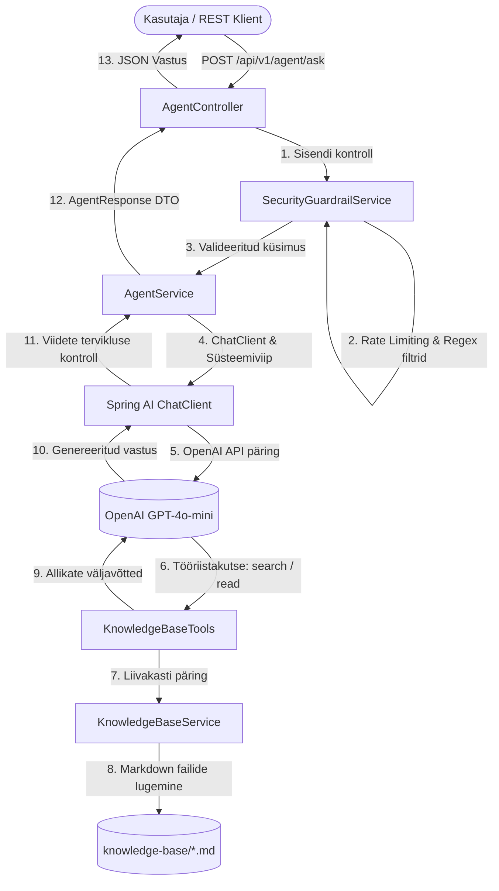

# Siseveebi IT-Teenuste Agendi Arhitektuuri- ja Turvadokument

### 1. Ülevaade ja Eesmärk
Siseveebi IT-teenuste agent on Spring Boot 3.3.5 ja Spring AI baasil loodud turvaline ja auditeeritav teenus, mis vastab töötajate IT-küsimustele rangelt asutuse sisedokumentatsiooni alusel.

---

### 2. Süsteemi Arhitektuur

---

### 3. Peamised Arhitektuurilised Otsused

1. **Tool-Calling Arhitektuur staatilise RAG-i asemel**:
   - Agent suhtleb teadmusbaasiga läbi registreeritud Spring AI funktsioonide (`searchKnowledgeBase`, `listTopics`, `getTopicContent`). See tagab täpse konteksti laadimise vastavalt mudeli vajadusele ning välistab liigse tokenikulu.
2. **Teenusepõhine Valideerimiskiht (Guardrail Pipeline)**:
   - Enne LLM-i väljakutset läbib kasutaja päring `SecurityGuardrailService` kontrolli (pikkusepiirangud, token-bucket rate limiting, regex-mustrid). See hoiab ära rünnakud ja säästab API kulusid.
3. **Liivakastis Markdown Teadmusbaas**:
   - Dokumendid asuvad `src/main/resources/knowledge-base/` kataloogis. Failinimesid valideeritakse range regulaaravaldisega, välistades Path Traversal ründed (`SEC-06`).
4. **Vastuse Järelkontroll ja Allikaviidete Garantiid**:
   - Kui `refused: false`, tagatakse alati vähemalt ühe kehtiva allika (`file`, `title`, `excerpt`) olemasolu ja tekstisisene viide (`[allikas: failinimi.md]`).

---

### 4. Turvameetmed ja Rünnakukindlus

| Ründemehhanism | Turvakaitse / Komponent | Lahendus |
|---|---|---|
| **Päringu ülepikkus (DDoS/Buffer)** | `SecurityGuardrailService` & `AgentRequest` | >2000 tähemärki blokeeritakse koheselt (HTTP 400 Bad Request) ilma LLM-kutsungita. |
| **Prompt Injection & DAN** | `SecurityGuardrailService` | Heuristiline mustrituvastus (eesti ja inglise keeles) püüab kinni rolli ülekatmise ja juhiste tühistamise katsed. |
| **Tundliku info leke** | `system-prompt.st` & `SecurityGuardrailService` | Süsteemiviiba ja paroolide küsimise katsed tõrjutakse koheselt. |
| **Path Traversal** | `KnowledgeBaseService` | Failiteed normaliseeritakse; lubatud on ainult `^[a-zA-Z0-9_-]+\.md$`. |
| **Päringute ülekoormus** | `RateLimiterService` | IP/Sessioonipõhine Token Bucket algoritm. |

---

### 5. Arhitektuursed Piirangud ja Edasiarenduste Teekaart (Roadmap)

Käesolev lahendus toimib eduka ja turvalise kontseptsioonitõestusena (PoC). Tootmiskeskkonda skaleerimisel ning süsteemi täpsuse ja töökindluse edasisel tõstmisel tuleks rakendada järgmised arhitektuursed täiustused:

- **Java platvormi moderniseerimine (Tehniline võlg / Java 25)**: Rakendus on esialgses etapis loodud pikaajalise toega **Java 21** baasil (kooskõlas Spring Boot 3.3 stabiilsusnõuetega). Tulevikus on planeeritud üleminek **Java 25** (või uuemale LTS versioonile) ja vastavale Spring AI / Spring Boot versioonile, et kasutada ära Java virtuaalsete lõimede (Project Loom / Virtual Threads) täit potentsiaali suure koormusega I/O operatsioonide teenindamisel ning uuemaid keele- ja kompileerimistäiendusi.
- **Otsinguloogika ja RAG-i optimeerimine**: Hetkel tagastab `searchKnowledgeBase` tööriist lühikesi väljavõtteid (*excerpts*). Äärmuslikes olukordades võivad need väljavõtted jätta välja väga spetsiifilisi detaile (nt 48-tunnine SLA tähtaeg või 2 ülevaataja nõue), mis võib viia mudeli lünkade täitmisel hallutsineerimiseni. Tuleviku parendusena tuleb agent häälestada spetsiifiliste detailipäringute puhul prioriseerima tööriista `getTopicContent`, et laadida ja analüüsida vastava teema täielikku dokumendikonteksti.
- **Mudeli parameetrite kalibreerimine**: Tootmiskõlbliku IT-kasutajatoe keskkonnas tuleb LLM-i temperatuuriparameetrit (`temperature`) langetada 0 lähedale. See seab esikohale range faktitruuduse ja determinismi loova teksti genereerimise ees ning minimeerib hallutsinatsioonide tekkeriski.
- **Semantiline otsing**: Teadmusbaasi mahu ja keerukuse kasvades tuleks praegune lihtne märksõna- ja failipõhine otsingumudel asendada vektorandmebaasiga (nt PostgreSQL koos `pgvector` laiendusega), mis tagab semantiliselt täpse, tähenduspõhise ja skaleeruva konteksti kättesaadavuse.
